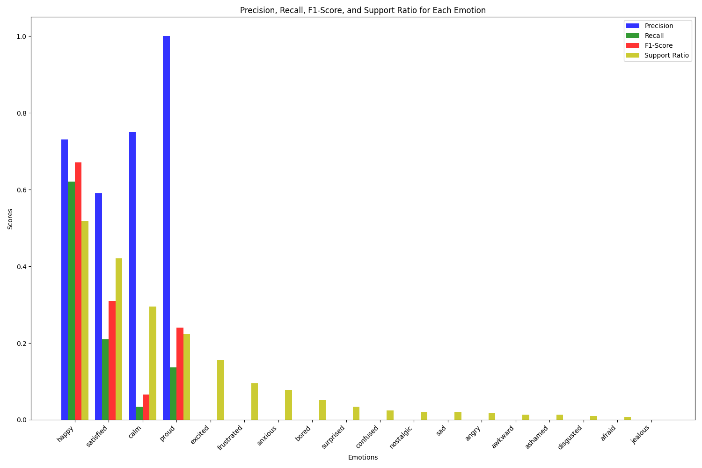

# CUCU: AI-powered Mental Health App for NYC High School Students

[](https://github.com/your-username/CUCU-pfizer-hackathon)
[](https://www.python.org/)
[](https://flask.palletsprojects.com/)
[](https://scikit-learn.org/)
[](https://www.sqlite.org/)
[](https://opensource.org/licenses/MIT)

> An intelligent journaling application that uses machine learning to analyze emotions and provide personalized mental health recommendations for high school students.

## 🎥 Demo Videos

<div align="center">
  <table>
    <tr>
      <td align="center">
        <strong>Interactive App Demo</strong><br/>
        <video width="400" controls>
          <source src="Presentation%20Files/app-interactive-figma.mp4" type="video/mp4">
          Your browser does not support the video tag.
        </video>
      </td>
      <td align="center">
        <strong>Live Demo Video</strong><br/>
        <video width="400" controls>
          <source src="Presentation%20Files/Demo%20Video.mov" type="video/quicktime">
          Your browser does not support the video tag.
        </video>
      </td>
    </tr>
  </table>
</div>

*Click on either video to play the interactive demonstration or watch the live demo presentation*

## 🏆 About the Competition

**Pfizer Digital Hackathon 2024** - This project was developed as part of Pfizer's annual digital innovation hackathon, focusing on creating solutions for mental health and wellness. CUCU secured **2nd Place** among competing teams, demonstrating exceptional technical implementation and social impact potential.

### Competition Goals
- Develop innovative digital solutions for mental health
- Address the growing mental health crisis among youth
- Create scalable, accessible mental health tools
- Leverage AI/ML for personalized mental health support

### Team Achievement
Our team of mechanical and electrical engineering students from The Cooper Union developed CUCU, an innovative mental health companion app that addresses critical gaps in NYC Department of Education mental health services.

## 🧠 What is CUCU?

**CUCU (Cooper Union Companion Unit)** is an AI-powered mental health companion app designed specifically for NYC high school students. The app analyzes journal entries using advanced machine learning algorithms to:

- **Detect and classify emotions** in real-time
- **Provide personalized activity recommendations** based on emotional state
- **Track emotional balance** over time
- **Offer visual insights** into emotional patterns
- **Maintain a secure digital journal** for reflection
- **Color-coded mood tracking** for intuitive understanding
- **Gamification elements** to encourage engagement

### Target Audience
- NYC High School Students (ages 14-18)
- Students seeking mental health support
- Educational institutions looking for student wellness tools
- NYC Department of Education schools

### The Problem We're Solving
- **38% of NYC high school students** reported feeling sad or hopeless in 2021
- Only **1,101 out of 1,524 public schools** had at least one social worker
- **80% of schools** did not meet the recommended social-worker-to-student ratio
- CUCU provides scalable, accessible mental health support to bridge this critical gap

## ✨ Key Features

- **🤖 AI-powered Virtual Companion**: Intelligent chatbot interface for student interaction
- **📝 Mood-based Journaling**: Structured journaling with emotion detection
- **🎨 Color-coded Mood Tracking**: Intuitive visual representation of emotional states
- **🧘‍♀️ Personalized Mental Health Activities**: Tailored recommendations based on emotional analysis
- **🏆 Gamification Elements**: Engagement features to encourage consistent use
- **📊 Administrative Dashboard**: Tools for school staff to monitor student wellness trends
- **Real-time Emotion Analysis**: Instantly analyzes journal entries for 18 different emotions
- **Emotional Balance Tracking**: Monitors overall emotional well-being over time
- **Visual Analytics**: Interactive pie charts showing emotion distribution
- **Secure Journaling**: Private, encrypted storage of personal entries
- **Responsive Web Interface**: Works seamlessly on desktop and mobile devices

## 🛠️ Technology Stack

### Backend
- **Python 3.8+**
- **Flask** - Web framework
- **SQLite** - Database
- **SQLAlchemy** - ORM

### Machine Learning
- **scikit-learn** - ML framework
- **Random Forest Classifier** - Multi-output classification
- **TF-IDF Vectorizer** - Text feature extraction
- **Pandas & NumPy** - Data processing

### Frontend
- **HTML5/CSS3** - Structure and styling
- **JavaScript/jQuery** - Interactive features
- **Chart.js** - Data visualization
- **Matplotlib** - Plot generation
- **React Native** - Planned for mobile development

### Data
- **1,474 labeled journal entries** for training
- **18 emotion categories** (happy, sad, anxious, excited, etc.)
- **10 activity categories** (exercise, family, friends, work, etc.)
- **Natural Language Processing (NLP)** - Advanced text analysis

## 🚀 Installation & Setup

### Prerequisites
- Python 3.8 or higher
- pip (Python package installer)

### Installation Steps

1. **Clone the repository**
   ```bash
   git clone https://github.com/your-username/CUCU-pfizer-hackathon.git
   cd CUCU-pfizer-hackathon
   ```

2. **Install dependencies**
   ```bash
   pip install -r requirements.txt
   ```

3. **Run the application**
   ```bash
   python gui.py
   ```

4. **Access the application**
   - Open your web browser
   - Navigate to `http://localhost:5000`
   - Start journaling and analyzing your emotions!

## 📖 How to Use

### Getting Started
1. **Write a Journal Entry**: Enter your thoughts, feelings, or daily experiences in the text area
2. **Analyze Emotions**: Click "Analyze" to process your entry
3. **Review Results**: View detected emotions, emotional balance score, and recommended activities
4. **Track Progress**: Monitor your emotional balance over time in the History tab

### Understanding Results
- **Emotion Distribution**: Pie chart showing the percentage of each detected emotion
- **Emotional Balance Score**: A numerical score indicating overall emotional well-being (0-100)
- **Color Representation**: Visual color coding based on emotional state
- **Activity Recommendations**: Personalized suggestions to improve mental health

## 🤖 Algorithm Details

### Machine Learning Approach
CUCU uses a **Multi-Output Random Forest Classifier** with **TF-IDF vectorization** for emotion classification:

- **Feature Extraction**: TF-IDF vectorization with 5,000 features
- **Classification**: Random Forest with 100 estimators
- **Multi-Output**: Simultaneously predicts 18 different emotions
- **Training Data**: 1,474 labeled journal entries

### Supported Emotions
The system can detect and classify 18 different emotions:
- Positive: Happy, Excited, Proud, Satisfied, Calm
- Negative: Sad, Angry, Anxious, Afraid, Frustrated
- Complex: Confused, Jealous, Nostalgic, Ashamed, Awkward
- Physical: Bored, Disgusted, Surprised

### Model Performance


## 📊 Dataset Information

- **Total Entries**: 1,474 journal entries
- **Emotion Labels**: 18 different emotion categories
- **Activity Labels**: 10 different activity categories
- **Data Source**: Annotated journal entries with emotion and activity labels
- **Text Processing**: UTF-8 encoded, preprocessed for ML training

## 📁 Project Structure

```
CUCU-pfizer-hackathon/
├── gui.py                 # Main Flask application
├── mood_classifier.py     # ML emotion classification engine
├── data.csv              # Training dataset (1,474 entries)
├── analysis/             # Analysis scripts and results
│   ├── dataset_analysis.py
│   └── emotion_classifier_metrics.png
├── db/                   # Database configuration
│   └── database.py
├── templates/            # HTML templates
│   └── index.html
├── instance/             # SQLite database files
├── requirements.txt      # Python dependencies
├── LICENSE              # MIT License
└── Presentation Files/   # Competition materials
    ├── Demo Video.mov
    ├── Cooper Union Pfizer Hackathon.pdf
    └── Cooper Union Pfizer Hackathon.pptx
```

### Key Files Explained
- **`gui.py`**: Flask web application with emotion analysis endpoints
- **`mood_classifier.py`**: Core ML engine using Random Forest + TF-IDF
- **`data.csv`**: Training dataset with 1,474 labeled journal entries
- **`templates/index.html`**: Interactive web interface with real-time analysis
- **`db/database.py`**: SQLAlchemy models for journal entries and emotions

## 🎯 Impact & Future Development

### Current Impact
- **2nd Place** at Pfizer Digital Hackathon 2024
- Demonstrated potential for scalable mental health support
- Validated ML approach for emotion classification
- Addressed critical gaps in NYC DOE mental health services

### 3-Year Development Roadmap

#### Phase 1: Foundation (Year 1)
- Advanced chatbot capabilities with NLP
- Beta testing with focus groups
- User experience optimization

#### Phase 2: Launch (Year 2)
- Initial launch in select Brooklyn and Queens schools
- Integration with school counseling services
- Administrative dashboard implementation

#### Phase 3: Expansion (Year 3)
- Iteration based on user feedback
- Expansion to other NYC schools
- Integration with private institutions
- Advanced analytics and reporting
- Multi-language support
- Real-time crisis detection and alerts

### Long-term Vision
- **Scalable mental health support** for all NYC students
- **Data-driven insights** for educational policy
- **Integration with existing school systems**
- **Mobile app development** for broader accessibility

## 👥 Contributors

### Team CUCU - The Cooper Union
- **Lizelle Ocfemia** (EE '25) - Electrical Engineering
- **Lamiah Khan** (EE '26) - Electrical Engineering  
- **Lei/Raymond Chi** (EE '25) - Electrical Engineering
- **Aaryan Mahipal** (ME '25) - Mechanical Engineering
- **Jaehyeon Park** (ME '26) - Mechanical Engineering

### Mentors & Support
- **Pfizer Technical Advisors** - Industry guidance and mentorship
- **Domain Experts** - Mental health professionals and educators
- **The Cooper Union Faculty** - Academic support and resources

## 📄 License

This project is licensed under the MIT License - see the [LICENSE](LICENSE) file for details.

---

## 🏅 Recognition

Our innovative approach and potential for significant impact earned us the **second-place prize** at the Pfizer 2024 Hackathon, validating our solution's technical excellence and social impact potential.

## 📚 Related Resources

- [Team Repository](https://github.com/raymond-chii/Hackathon) - Additional project details
- [Presentation Slides](Presentation%20Files/Cooper%20Union%20Pfizer%20Hackathon.pdf) - Competition presentation
- [Demo Video](Presentation%20Files/Demo%20Video.mov) - Live demonstration

---

**Built with ❤️ for mental health awareness and student wellness**

*Developed at Pfizer Digital Hackathon 2024 - 2nd Place Winner*

*Team CUCU - The Cooper Union*
